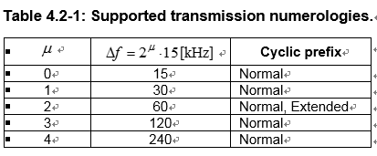
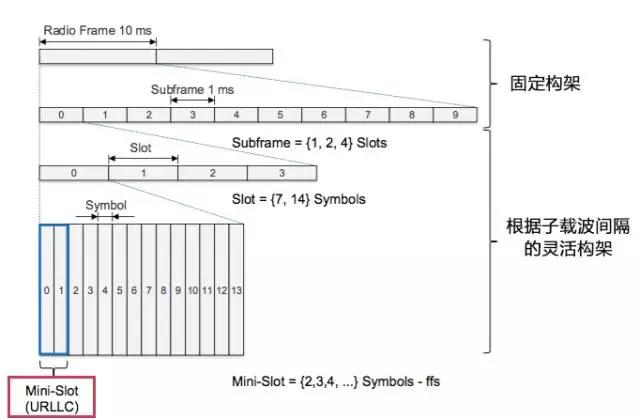
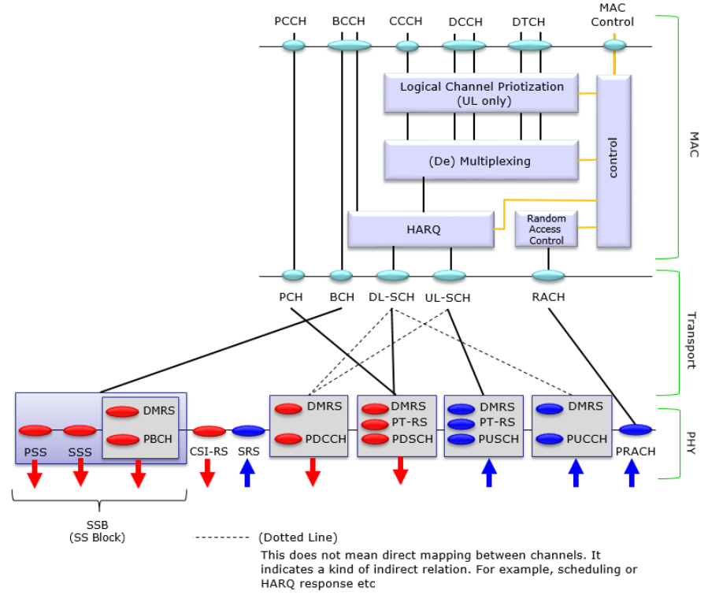
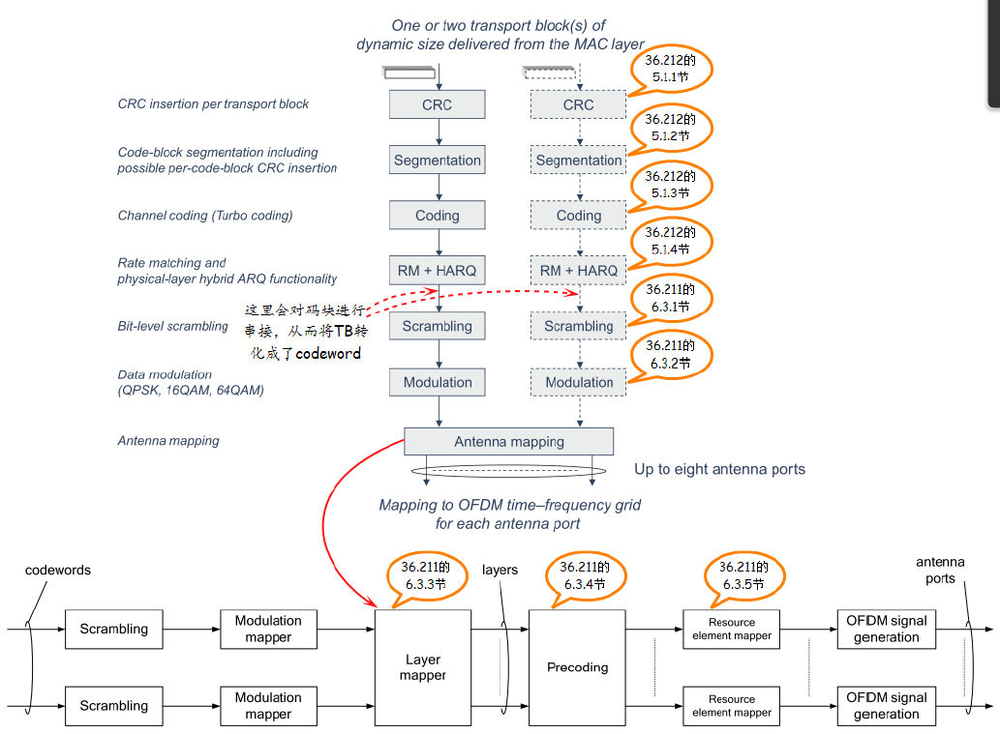

# 5G Basics
- [5G Basics](#5g-basics)
    - [5G Arch](#5g-arch)
    - [5G frequency Bands](#5g-frequency-bands)
        - [Lower 5G Bands in sub 6GHz](#lower-5g-bands-in-sub-6ghz)
        - [Higher 5G Frequency Bands in mmwave](#higher-5g-frequency-bands-in-mmwave)
    - [bandwidth](#bandwidth)
        - [Transmission bandwidth configuration NRB for FR1(below 6 GHz)](#transmission-bandwidth-configuration-nrb-for-fr1below-6-ghz)
        - [Transmission bandwidth configuration NRB for FR2](#transmission-bandwidth-configuration-nrb-for-fr2)
    - [radio frame](#radio-frame)
        - [SCS](#scs)
        - [NR frame](#nr-frame)
    - [channel mapping](#channel-mapping)
    - [Physical layer](#physical-layer)
        - [Physical layer procedure](#physical-layer-procedure)

## 5G Arch

## 5G frequency Bands

### Lower 5G Bands in sub 6GHz

| Country | 5G Bands                                           |
| ------- | -------------------------------------------------- |
| Europe  | 3400 - 3800 MHz ( for trial )                      |
| China   | 3300 - 3600 MHz , 4400 - 4500 MHz, 4800 - 4990 MHz |
| Japan   | 3600 - 4200 MHz , 4400 - 4900 MHz                  |
| Korea   | 3400 - 3700 MHz                                    |
| USA     | 3100 - 3550 MHz, 3700 - 4200 MHz                   |
| INDIA   | 3300 MHz and 3400 MHz                              |
| Ireland | 3.4 - 3.8 GHz                                      |
| Spain   | 3.6 - 3.8 GHz                                      |

### Higher 5G Frequency Bands in mmwave

| Country | 5G Frequency Bands              |
| ------- | ------------------------------- |
| USA     | 27.5 - 28.35 GHz , 37 - 40 GHz  |
| Korea   | 26.5 - 29.5 GHz                 |
| Japan   | 27.5 - 28.28 GHz                |
| China   | 24.25 - 27.5 GHz, 37 - 43.5 GHz |
| Sweden  | 26.5 - 27.5 GHz                 |
| EU      | 24.25 - 27.5 GHz                |

## bandwidth

### Transmission bandwidth configuration NRB for FR1(below 6 GHz)

SCS [kHz] |5 MHz|10 MHz|15 MHz|20 MHz|25 MHz|30 MHz | 40 MHz|50 MHz|60 MHz|70 MHz|80 MHz|90 MHz|100 MHz
-|-|-|-|-|-|-|-|-|-|-|-|-|-
||NRB |NRB |NRB |NRB |NRB |NRB |NRB |NRB |NRB |NRB |NRB |NRB |NRB |
15|25|52|79|106|133|160|216|270|N.A|N.A|N.A|N.A|N.A|
30|11|24|38|51|65|78|106|133|162|189|217|245|273|
60|N.A|11|18|24|31|38|51|65|79|93|107|121|135|

### Transmission bandwidth configuration NRB for FR2

SCS [kHz]|50 MHz|100 MHz|200 MHz|400 MHz
-|-|-|-|-
| |NRB |NRB |NRB |NRB |
60|66|132|264|N.A
120|32|66|132|264

## radio frame

### SCS

### NR frame
* one radio frame: 10ms
* one subframe: 1ms
* number of slots per subframe: 2^u
* number of symbols per slot: 14
* A resource block is defined as 12 consecutive subcarriers in the frequency domain
* common resource block: k/12, k is the index in the frequency domain.
* 
  

## channel mapping

## Physical layer

The physical channels defined in the downlink are: 
-	the Physical Downlink Shared Channel (PDSCH), 
-	the Physical Downlink Control Channel (PDCCH), 
-	the Physical Broadcast Channel (PBCH), 
The physical channels defined in the uplink are: 
-	the Physical Random Access Channel (PRACH),
-	the Physical Uplink Shared Channel (PUSCH), 
-	and the Physical Uplink Control Channel (PUCCH). 
In addition, signals are defined as reference signals, primary and secondary synchronization signals.
The modulation schemes supported are 
-	in the downlink, QPSK, 16QAM, 64QAM, and 256QAM,
-	in the uplink, QPSK, 16QAM, 64QAM and 256QAM for OFDM with a CP and π/2-BPSK, QPSK, 16QAM, 64QAM and 256QAM for DFT-s-OFDM with a CP

### Physical layer procedure
  
scrambling -> modulation(xx QAM) -> layer mapping(1~8) -> antenna port mapping(precoding) -> mapping to virtual resource block -> mapping to physical resource block(OFDM symbol)

basic concept:

- TB(transport block)
  
  Include one MAC PDU, sent in one TTI.

- codeword:

  1TB generate 1 codeword after CRC,Segmentation,coding and RM.

- layer(transmission layer)
  
  1 or 2 codewords scrambling and modulation get complex module symbol mapping to multiple layers, each layer is one data stream. Layer number <= min(TX antenna port, RX antenna port). number of layer called rank

- precoding:

  layer(R) mapping to antenna port, using R\*P precoding martrix. *codebook* is collections of precoding martrixes.

- antenna port:

  logic concept, can be one or more real antenna. Each antenna port need one reference signal.

- number relation:
  
  TB = codeword <= layer <= antenna port
