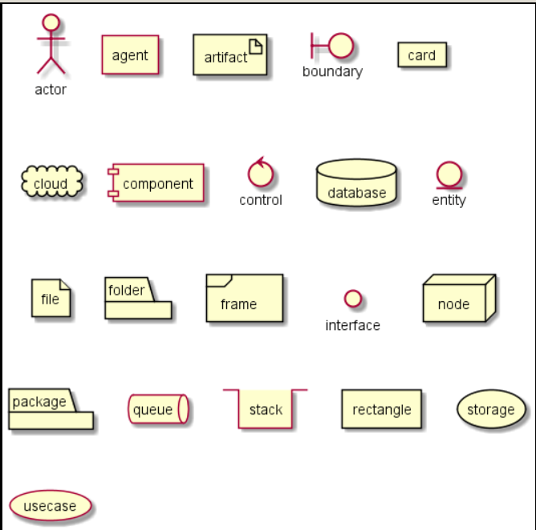

# VSCode Extensions and Commands
- [VSCode Extensions and Commands](#vscode-extensions-and-commands)
  - [Offical docs](#offical-docs)
  - [Basic Key Bindings](#basic-key-bindings)
  - [Extensions](#extensions)
    - [Markdown](#markdown)
    - [Robot Framework](#robot-framework)
    - [Python](#python)
    - [PlantUML](#plantuml)

## Offical docs

https://code.visualstudio.com/docs - VSCode

## Basic Key Bindings

**General**

| Command          | Description             |
| ---------------- | ----------------------- |
| Ctrl+Shift+P, F1 | Show Command Palette    |
| Ctrl+P           | Quick Open, Go to File… |
| Ctrl+Shift+N     | New window/instance     |
| Ctrl+Shift+W     | Close window/instance   |
| Ctrl+,           | User Settings           |
| Ctrl+K Ctrl+S    | Keyboard Shortcuts      |

**Basic editing**

| Command           | Description                                               |
| ----------------- | --------------------------------------------------------- |
| Ctrl+X            | Cut line (empty selection)                                |
| Ctrl+C            | Copy line (empty selection)                               |
| Alt+ ↑ / ↓        | Move line up/down                                         |
| Shift+Alt + ↓ / ↑ | Copy line up/down                                         |
| Ctrl+Shift+K      | Delete line                                               |
| Ctrl+Enter        | Insert line below                                         |
| Ctrl+Shift+Enter  | Insert line above                                         |
| Ctrl+Shift+\      | Jump to matching bracket                                  |
| Ctrl+] / [        | Indent/outdent line Home / End Go o beginning/end of line |
| Ctrl+Home         | Go to beginning of file                                   |
| Ctrl+End          | Go to end of file                                         |
| Ctrl+↑ / ↓        | Scroll line up/down                                       |
| Alt+PgUp / PgDn   | Scroll page up/down                                       |
| Ctrl+Shift+[      | Fold (collapse) region                                    |
| Ctrl+Shift+]      | Unfold (uncollapse) region                                |
| Ctrl+K Ctrl+[     | Fold (collapse) all subregions                            |
| Ctrl+K Ctrl+]     | Unfold (uncollapse) all subregions                        |
| Ctrl+K Ctrl+0     | Fold (collapse) all regions                               |
| Ctrl+K Ctrl+J     | Unfold (uncollapse) all regions                           |
| Ctrl+K Ctrl+C     | Add line comment                                          |
| Ctrl+K Ctrl+U     | Remove line comment                                       |
| Ctrl+/            | Toggle line comment                                       |
| Shift+Alt+A       | Toggle block comment                                      |
| Alt+Z             | Toggle word wrap                                          |

**Navigation**

| Command        | Description                     |
| -------------- | ------------------------------- |
| Ctrl+T         | Show all Symbols                |
| Ctrl+G         | Go to Line...                   |
| Ctrl+P         | Go to File...                   |
| Ctrl+Shift+O   | Go to Symbol...                 |
| Ctrl+Shift+M   | Show Problems panel             |
| F8             | Go to next error or warning     |
| Shift+F8       | Go to previous error or warning |
| Ctrl+Shift+Tab | Navigate editor group history   |
| Alt+ ← / →     | Go back / forward               |
| Ctrl+M         | Toggle Tab moves focus          |

**Search and replace**

| Command       | Description                                |
| ------------- | ------------------------------------------ |
| Ctrl+F        | Find                                       |
| Ctrl+H        | Replace                                    |
| F3 / Shift+F3 | Find next/previous                         |
| Alt+Enter     | Select all occurences of Find match        |
| Ctrl+D        | Add selection to next Find match           |
| Ctrl+K Ctrl+D | Move last selection to next Find match     |
| Alt+C / R / W | Toggle case-sensitive / regex / whole word |

**Multi-cursor and selection**

| Command                      | Description                                 |
| ---------------------------- | ------------------------------------------- |
| Alt+Click                    | Insert cursor                               |
| Ctrl+Alt+ ↑ / ↓              | Insert cursor above / below                 |
| Ctrl+U                       | Undo last cursor operation                  |
| Shift+Alt+I                  | Insert cursor at end of each line selected  |
| Ctrl+I                       | Select current line                         |
| Ctrl+Shift+L                 | Select all occurrences of current selection |
| Ctrl+F2                      | Select all occurrences of current word      |
| Shift+Alt+→                  | Expand selection                            |
| Shift+Alt+←                  | Shrink selection                            |
| Shift+Alt + (drag mouse)     | Column (box) selection                      |
| Ctrl+Shift+Alt + (arrow key) | Column (box) selection                      |
| Ctrl+Shift+Alt + PgUp/PgDn   | Column (box) selection page up/down         |

**Rich languages editing**

| Command          | Description                     |
| ---------------- | ------------------------------- |
| Ctrl+Space       | Trigger suggestion              |
| Ctrl+Shift+Space | Trigger parameter hints         |
| Shift+Alt+F      | Format document                 |
| Ctrl+K Ctrl+F    | Format selection                |
| F12              | Go to Definition                |
| Alt+F12          | Peek Definition                 |
| Ctrl+K           | F12 Open Definition to the side |
| Ctrl+.           | Quick Fix                       |
| Shift+F12        | Show References                 |
| F2               | Rename Symbol                   |
| Ctrl+K Ctrl+X    | Trim trailing whitespace        |
| Ctrl+K M         | Change file language            |

**Editor management**

| Command                | Description                             |
| ---------------------- | --------------------------------------- |
| Ctrl+F4,               | Ctrl+W Close editor                     |
| Ctrl+K F               | Close folder                            |
| Ctrl+\                 | Split editor                            |
| Ctrl+ 1 / 2 / 3        | Focus into 1st, 2nd or 3rd editor group |
| Ctrl+K Ctrl+ ←/→       | Focus into previous/next editor group   |
| Ctrl+Shift+PgUp / PgDn | Move editor left/right                  |
| Ctrl+K ← / →           | Move active editor group                |

**File management**

| Command        | Description                             |
| -------------- | --------------------------------------- |
| Ctrl+N         | New File                                |
| Ctrl+O         | Open File...                            |
| Ctrl+S         | Save                                    |
| Ctrl+Shift+S   | Save As...                              |
| Ctrl+K S       | Save All                                |
| Ctrl+F4        | Close                                   |
| Ctrl+K Ctrl+W  | Close All                               |
| Ctrl+Shift+T   | Reopen closed editor                    |
| Ctrl+K         | Enter Keep preview mode editor open     |
| Ctrl+Tab       | Open next                               |
| Ctrl+Shift+Tab | Open previous                           |
| Ctrl+K P       | Copy path of active file                |
| Ctrl+K R       | Reveal active file in Explorer          |
| Ctrl+K O       | Show active file in new window/instance |

**Display**

| Command      | Description                                |
| ------------ | ------------------------------------------ |
| F11          | Toggle full screen                         |
| Shift+Alt+0  | Toggle editor layout (horizontal/vertical) |
| Ctrl+ = / -  | Zoom in/out                                |
| Ctrl+B       | Toggle Sidebar visibility                  |
| Ctrl+Shift+E | Show Explorer / Toggle focus               |
| Ctrl+Shift+F | Show Search                                |
| Ctrl+Shift+G | Show Source Control                        |
| Ctrl+Shift+D | Show Debug                                 |
| Ctrl+Shift+X | Show Extensions                            |
| Ctrl+Shift+H | Replace in files                           |
| Ctrl+Shift+J | Toggle Search details                      |
| Ctrl+Shift+U | Show Output panel                          |
| Ctrl+Shift+V | Open Markdown preview                      |
| Ctrl+K V     | Open Markdown preview to the side          |
| Ctrl+K Z     | Zen Mode (Esc Esc to exit)                 |

**Debug**

| Command         | Description       |
| --------------- | ----------------- |
| F9              | Toggle breakpoint |
| F5              | Start/Continue    |
| Shift+F5        | Stop              |
| F11 / Shift+F11 | Step into/out     |
| F10             | Step over         |
| Ctrl+K Ctrl+I   | Show hover        |

**Integrated terminal**

| Command           | Description                |
| ----------------- | -------------------------- |
| Ctrl+`            | Show integrated terminal   |
| Ctrl+Shift+`      | Create new terminal        |
| Ctrl+C            | Copy selection             |
| Ctrl+V            | Paste into active terminal |
| Ctrl+↑ / ↓        | Scroll up/down             |
| Shift+PgUp / PgDn | Scroll page up/down        |
| Ctrl+Home / End   | Scroll to top/bottom       |

## Extensions

### Markdown

1. Markdown All in One

* Keyboard shortcuts

| Command          | Description                  |
| ---------------- | ---------------------------- |
| Ctrl + b         | toggle bold                  |
| Ctrl + I         | Toggle italic                |
| Alt + S          | Toggle strikethrough         |
| Ctrl + Shift + ] | Toggle heading (uplevel)     |
| Ctrl + Shift + [ | Toggle heading (downlevel)   |
| Ctrl + M         | Toggle math environment      |
| Alt + C          | Check/Uncheck task list item |

* Available Commands
  * Markdown: Create Table of Contents
  * Markdown: Update Table of Contents
  * Markdown: Toggle code span
  * Markdown: Print current document to HTML

2. markdownlint

>Markdown linting and style cheking

### Robot Framework

1. Robot Framework Intellisense

>Requires that the .py files are included with rfLanguageServer.includePaths setting. E.g.
"rfLanguageServer.includePaths": [
"**/*.robot",
"**/*.py"
]

| Command      | Description                                                      |
| ------------ | ---------------------------------------------------------------- |
| F12          | Goto definition                                                  |
| Ctrl + Left  | Goto definition                                                  |  |
| Shift+F12    | Find all references                                              |
| Ctrl+Shift+O | List file symbols(Shows variables, keywords and test cases)      |
| Ctrl+T       | List workspace symbols(Shows variables, keywords and test cases) |
| Ctrl+Space   | Show Code Completion Proposals                                   |

2. robot framework language

>User define system environment variable PY_SITE_PATH, which indicate the site package path  
>Linux:  
>export PY_SITE_PATH="/lib/python2.7/site-packages/"

| Command     | Description     |
| ----------- | --------------- |
| F12         | Goto definition |
| Ctrl + Left | Goto definition |

### Python

>From within VS Code, select a Python interpreter by opening the Command Palette (Ctrl+Shift+P), start typing the Python: Select Interpreter command to search, then select the command.

>Formating: pip install pep8

| Command     | Description         |
| ----------- | ------------------- |
| F12         | Goto definition     |
| Ctrl + Left | Goto definition     |
| Shift+F12   | Find all references |
| F2          | Rename Symbol       |

### PlantUML
> It's necessary to have following installed:  
> * Java
> * Graphviz(yum intall graphviz)  

| Command     | Description         |
| ----------- | ------------------- |
| Left click | zoom in 
| Alt + left click | zoom out 
| Alt + D | Preview 
|Alt + Shift + F | Format code

>Basic elements

